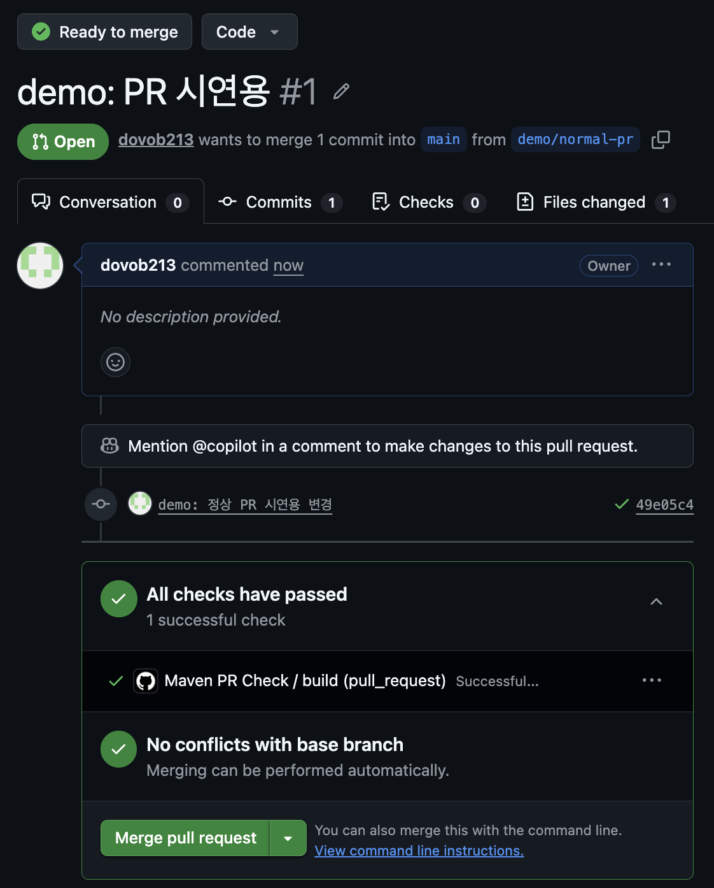
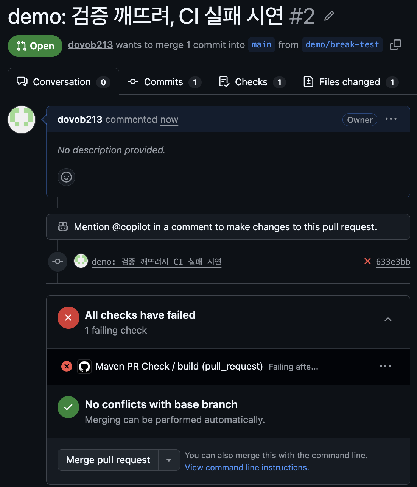

# GitHub Actions 를 활용한 Maven 빌드 및 자동 PR 체크

OSSCA egov-vscode 2026 / Issue #13

---

## 1. 왜 자동 PR 체크인가?

- 사람이 매번 `mvn test` 돌리고 PR 올리는 건 깜빡하기 쉽다.
- 머지하고 나서 main 이 깨지면 다른 사람 작업까지 막힌다.
- 리뷰어는 로직에 집중해야지, 빌드 깨졌는지 확인할 시간이 없다.

→ "봇이 먼저 빌드/테스트 해보고, 통과해야만 머지 가능" 하게 만들자

---

## 2. GitHub Actions 30 초 개념

- Workflow: `.github/workflows/*.yml` 1 개 = 시나리오 1 개
- Trigger (`on:`): 언제 돌릴지 — push, pull_request, schedule 등
- Job: 가상 머신(`runs-on`) 위에서 도는 작업 묶음
- Step: job 안의 한 단계 — 셸 명령 또는 재사용 가능한 `action`
- Action: 남이 만든 step (예: `actions/checkout`, `actions/setup-java`)

---

## 3. 발표 키워드와 예제의 매핑

| 발표 키워드 | 예제에서의 구현 |
|---|---|
| GitHub Actions | `maven-pr-check.yml` 워크플로 정의 |
| Maven 빌드 | `mvn -B clean verify` 한 줄로 컴파일 + 테스트 |
| 자동 PR 체크 | `on: pull_request` + Branch Protection 으로 머지 차단 |
| 협업 안전성 | `paths` 필터로 다른 분들의 PR과 분리 |

---

## 4. 예제 프로젝트 구조

```text
github-actions-maven-pr-check
├── pom.xml                  # JUnit5 만 있는 최소 Maven
├── maven-pr-check.yml       # 워크플로 (참고용)
├── src
│   ├── main/java/com/example/minwon
│   │   ├── MinwonType.java        # 민원 종류 enum
│   │   ├── MinwonRequest.java     # 신청 요청 (record)
│   │   ├── EgovBizException.java  # eGov 표준 예외 패턴 흉내
│   │   └── MinwonService.java     # 검증 + 접수번호 채번
│   └── test/java/com/example/minwon/MinwonServiceTest.java
├── images                   # fork 시연 스크린샷
└── README.md
```

도메인은 '민원 신청 검증' — eGov 색은 살리되, Spring/MyBatis 없이 POJO 만 사용.
CI 흐름을 보여주는 게 목적이라 일부러 가볍게 유지했습니다

---

## 4-1. 예제 vs 진짜 eGovFrame

발표 흐름을 가볍게 유지하려고 진짜 eGov 컴포넌트는 "모양만" 흉내냈습니다.

| 항목 | 본 예제 | 진짜 eGovFrame |
|---|---|---|
| 비즈니스 예외 | `EgovBizException` POJO | `egovframework.rte.fdl.cmmn.exception.EgovBizException` |
| 검증 위치 | Service 안에서 직접 if | `@NotBlank` 등 Bean Validation + GlobalExceptionHandler |
| 접수번호 채번 | `System.currentTimeMillis()` | `EgovIdGnrService` (채번 테이블) |
| DTO | Java `record` | 일반 클래스 + Lombok |
| errorCode 컨벤션 | `"E001"` | 운영 시스템은 도메인 prefix 까지 (`"MIN_E001"`) |

→ 도메인 모양만 비슷하게, 의존성은 0. 이래야 CI 데모가 가볍습니다.

---

## 5. 워크플로 yml 핵심 (1) — 트리거

```yaml
on:
  pull_request:
    paths:
      - 'github-actions-maven-pr-check/**'
```

- `on.pull_request`: PR 이 열리거나 새 커밋이 push 될 때마다 실행
- `paths` 필터: 이 폴더가 바뀐 PR 만 트리거 → 다른 분들 작업에 영향 X

---

## 6. 워크플로 yml 핵심 (2) — 빌드

```yaml
jobs:
  build:
    runs-on: ubuntu-latest
    steps:
      - uses: actions/checkout@v4
      - uses: actions/setup-java@v4
        with:
          java-version: '17'
          distribution: 'temurin'
          cache: maven           # ← ~/.m2 캐시
      - run: mvn -B clean verify
```

- `cache: maven` 한 줄: 의존성 다운로드 캐시 → 빌드 시간 절반 이하
- `-B`: batch mode, CI 권장 (불필요한 진행 출력 제거)

---

## 7. 왜 이 레포에선 yml 을 폴더 안에 뒀나

- GitHub Actions 는 레포 루트의 `.github/workflows/` 만 인식
- 우리 학습 레포는 학생 30명이 공유 → 루트에 두면 다른 사람 PR 도 다 트리거됨
- 그래서 이 발표 예제는:
  - 레포에는 폴더 안에 `maven-pr-check.yml` 만 보관 (참고용)
  - 시연은 제 개인 fork 의 `.github/workflows/` 로 복사해서 진행

---

## 8. 시연 ① — 정상 PR (✅)



- fork 에 더미 변경 push → PR 생성
- Actions 가 자동 실행, 30 초 안에 green check
- "Merge" 버튼이 활성화됨

---

## 9. 시연 ② — 깨진 PR (❌)



- `MinwonService.validate()` 의 `length() < 2` 를 `< 0` 으로 변경
  → "홍" 같은 1자 이름이 통과해버려서 `신청자명이_1자면_E001_예외가_발생한다` 테스트 실패
- PR 에 즉시 red X + 어느 테스트가 왜 깨졌는지 표시
- "Merge" 버튼 회색 처리 (Branch Protection 적용 시)

---

## 10. Branch Protection 으로 강제하기

GitHub → Settings → Branches → main 브랜치 룰 추가:

- ✅ Require status checks to pass before merging
- ✅ "Maven PR Check / build" 체크박스 선택

→ CI 통과해야만 머지 버튼 활성화.
여기까지 해야 "자동 PR 체크 시스템" 이 완성됩니다.

---


## 11. 마무리

- 핵심 한 줄: "빌드 깨짐을 사람이 아닌 봇이 먼저 잡는다"
- yml 30 줄 + Branch Protection 설정 한 번 = 머지 사고 예방

