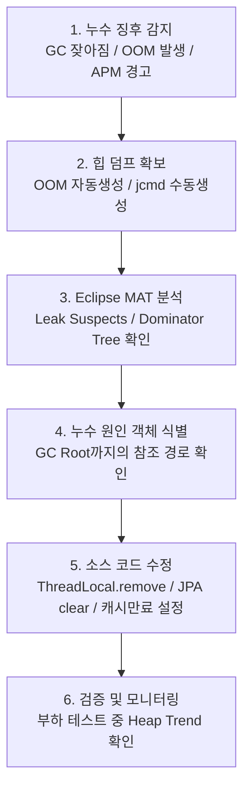

# eGovFramework 애플리케이션 Java Heap Dump 분석 및 메모리 누수 해결 가이드

---

### 1. "GC가 다 청소해 주는데 왜 메모리가 부족할까?"

- **GC의 기준**: GC Root(실행 중인 스레드, static 변수 등)에서 참조 연결 고리가 이어져 있으면 무조건 사용 중인 것으로 간주(Reachable).
- **누수의 실체**: 비즈니스적으로는 볼일이 다 끝난 '좀비 객체'인데, 코드 어딘가에 실수가 있어 참조 끈을 끊어주지 않아 GC가 치우고 싶어도 법적으로 치우지 못하는 상황을
  비유로 들어 설명하면 청중이 매우 쉽게 이해합니다.

### 2. Java 8 (Parallel GC) vs Java 17 (G1 GC) 의 청소 방식 차이

- **발표 포인트**: Java 17 프로젝트를 쓰는 이유를 기술적으로 당당하게 설명할 수 있습니다.
- **스토리**:
    - 과거 Java 8의 Parallel GC는 힙 영역 전체를 한 번에 쓸어 담듯 청소하느라 **Stop-The-World (STW)**가 길었습니다 (방 전체를 한 번에
      청소하려고 청소 시간 동안 집안 사람을 모두 밖으로 내보내는 격).
    - 반면 Java 17의 디폴트인 **G1 GC**는 전체 영역을 바둑판(Region) 모양으로 잘게 쪼개어, **쓰레기가 가장 많이 찬 영역부터 쏙쏙 골라 그때그때 청소
      **합니다. 이 덕분에 시스템 멈춤 시간이 획기적으로 줄어들었습니다.

### 3. IntelliJ Ultimate을 활용한 실시간 라이브 데모 (피날레)

- **발표 포인트**: 이론만 설명하는 지루한 세션을 탈피하고, 실질적인 해결책을 보여줍니다.
- **스토리**:
    - "이론은 여기까지 보고, 실제로 인텔리제이를 켜서 5초 만에 메모리 누수 범인을 잡아보겠습니다" 하고 보여주는 슬라이드 또는 라이브 코딩 데모입니다.
    - 앞서 설명해 드린 **`Profiler` 탭에서 메모리 스냅샷을 뜬 후 `Paths to GC Roots`를 열어 범인 객체의 강력한 참조 사슬을 끊어내는 흐름**을
      직접 화면으로 보여주면 발표의 완성도가 극대화됩니다.

---

---

## 1. 메모리 누수(Memory Leak) 진단 흐름도

메모리 누수 해결은 다음과 같은 순서로 진행됩니다.



---

## 2. Java 힙 덤프(Heap Dump) 생성 방법

힙 덤프는 특정 시점의 JVM 힙 메모리 스냅샷(바이너리 파일)입니다. 분석을 위해서는 덤프 파일(`.hprof`)을 추출해야 합니다.

### 2.1. OutOfMemoryError 발생 시 자동 생성 설정 (권장)

애플리케이션 구동 시 JVM 옵션에 아래 설정을 추가하면, OOM이 발생하는 즉시 그 순간의 힙 상태를 자동으로 기록합니다.

```bash
-XX:+HeapDumpOnOutOfMemoryError
-XX:HeapDumpPath=/log/dumps/egov-app-oom.hprof
```

> [!IMPORTANT]
>
> - OOM이 발생할 때 덤프 파일이 생성되는 동안 JVM이 일시적으로 멈출 수 있습니다.
> - 디스크 공간이 힙 메모리 크기(예: -Xmx4g 면 최소 4GB 이상)만큼 충분한지 확인하십시오.

### 2.2. 실행 중인 JVM에서 수동으로 생성하기

애플리케이션이 멈추지는 않았으나 메모리가 계속 우상향하는 경우, JVM이 구동 중인 상태에서 직접 추출합니다.

1. **JVM 프로세스 ID(PID) 확인**:

    ```bash
    jps -v
    # 또는
    ps -ef | grep java
    ```

2. **`jcmd` 명령어로 덤프 생성 (Java 9 이상 권장)**:

    ```bash
    jcmd <PID> GC.heap_dump /absolute/path/to/egov-dump.hprof
    ```

3. **`jmap` 명령어로 덤프 생성 (전통적인 방식)**:

    ```bash
    jmap -dump:format=b,file=/absolute/path/to/egov-dump.hprof <PID>
    ```

### 2.3. Spring Boot Actuator 사용 (개발 환경 전용)

`pom.xml`에 Actuator가 포함되어 있다면 웹 브라우저나 HTTP 클라이언트로 즉시 힙 덤프를 다운로드받을 수 있습니다.

- URL: `http://localhost:8080/actuator/heapdump`
- [!WARNING]
  운영 환경에서는 이 엔드포인트를 노출하지 않거나, 스프링 시큐리티를 통해 접근을 엄격히 통제해야 합니다. 대용량 힙의 경우 덤프를 생성하는 행위 자체가 OOM을 유발할 수
  있으므로 주의해야 합니다.

---

## **3. IntelliJ IDEA를 활용한 분석 방법**

별도의 외부 도구 설치 없이 평소 사용하시는**IntelliJ IDEA**(특히**Ultimate 에디션**) 내에서도 매우 직관적이고 강력한 힙 덤프 분석 기능을 지원합니다.

### **3.1. IntelliJ에서 실시간으로 덤프 생성 및 분석하기 (Profiler 탭)**

로컬에서 애플리케이션을 구동 중일 때 가장 쉽게 덤프를 뜨는 방법입니다.

1. IntelliJ에서 프로젝트를 실행할 때 상단의 실행 버튼 중**`Run with Profiler`**(또는`Profile 'AppName'`) 버튼을 클릭하여 앱을
   실행합니다.
2. 하단에**Profiler**탭이 나타나며 CPU 및 Memory 점유율이 실시간 그래프로 그려집니다.
3. 그래프 상단의**`Capture Memory Snapshot`**아이콘(카메라 모양 또는 덤프 모양)을 클릭합니다.
4. 클릭하는 순간 현재 시점의`.hprof`덤프 파일이 자동 생성되고 IntelliJ가 바로 분석 화면을 띄워줍니다.

### **3.2. 기존 힙 덤프 파일(`.hprof`) 열기**

외부 서버에서 다운로드받은`.hprof`파일이 있는 경우:

1. IntelliJ 상단 메뉴에서 **`File`->`Open`*을 누르고 해당`.hprof`파일을 선택합니다.
2. 또는 덤프 파일을 IntelliJ 편집 영역으로 드래그 앤 드롭합니다.
3. IntelliJ가 자동으로 파일 인덱싱을 완료한 뒤 힙 덤프 분석 전용 뷰어를 실행합니다.

### **3.3. IntelliJ 힙 덤프 뷰어 주요 기능**

- **Classes 탭**: 힙 내의 모든 클래스 목록과 인스턴스 개수(Count), 총 메모리 점유 크기(Size)를 보여줍니다.
    - *Tip*: 상단 필터창에 분석하려는 패키지명(예:`egovframework`)을 입력하여 커스텀 클래스들만 좁혀서 볼 수 있습니다.
- **Dominator Tree**: Eclipse MAT와 동일하게 메모리를 크게 차지하는 객체 계층 구조를 직관적인 UI로 탐색할 수 있습니다.
- **Paths to GC Roots**: 의심되는 객체를 마우스 우클릭하고**`Merge Shortest Paths to GC Roots`**-> **
  `Exclude Weak/Soft/Phantom References`*를 선택하면, 메모리가 해제되지 않고 묶여 있는 Strong Reference 참조 체인을 단번에 시각화해
  줍니다.

**CAUTION**

**IntelliJ Community 에디션 사용자 참고 사항**:

- IntelliJ**Community**에디션은 프로파일러 및`.hprof`파일 직접 분석 기능을 기본 제공하지 않거나 매우 제한적입니다.
- Community 버전을 사용 중이시라면 본 가이드의**`4. Eclipse MAT`**또는 **`JDK 내장 VisualVM`*을 사용하는 것이 훨씬 상세한 분석이
  가능합니다.