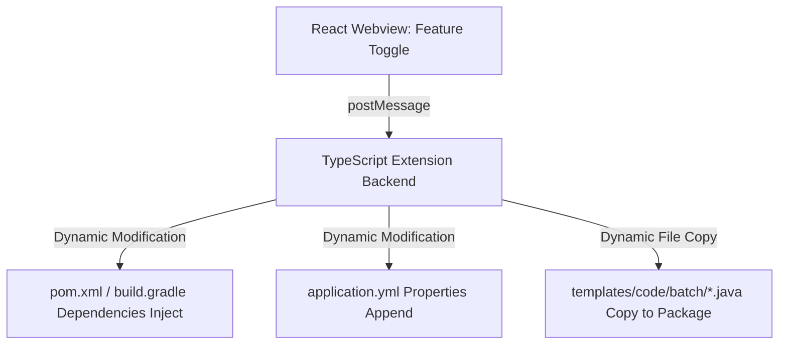
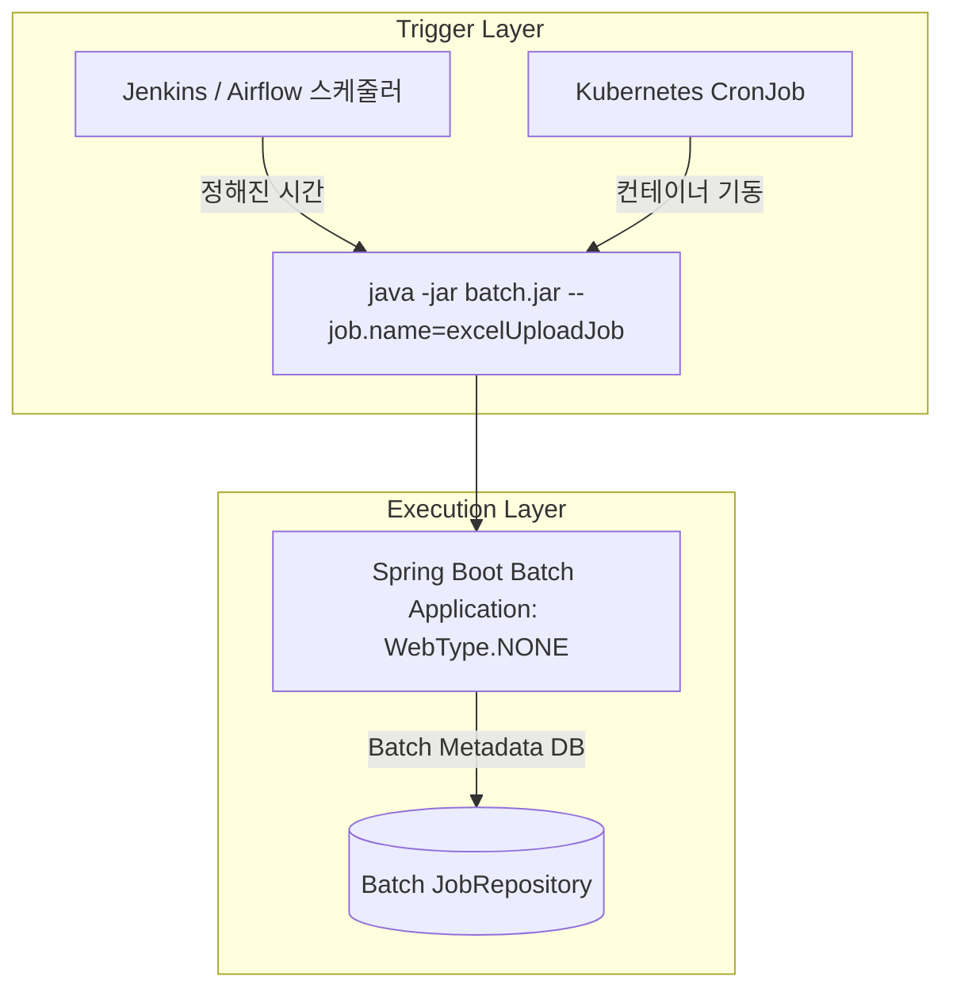

# 전자정부 표준프레임워크 배치 아키텍처 고도화 및 VSCode 이니셜라이저 연계 기술 제안서

본 제안서는 대용량 데이터 처리 과정에서 발생하는 메모리 적체 및 데이터베이스 I/O 병목 문제를 해결한 **고성능 엑셀 스트리밍 적재 파이프라인(Spring Boot 3.4 / Spring Batch 5.2 기반)**의 기술적 구조와 벤치마크 결과를 제시하고, 이를 **전자정부 표준프레임워크 공식 VSCode Initializr 확장 프로그램**에 동적 피처로 결합하기 위한 기술적 상세 분석 및 구현 방안을 다룬다.

---

## 📂 1. 전자정부 표준프레임워크 공식 배치 템플릿 실태 및 분석

공식 `egovframe-vscode-initializr` 프로젝트 내 Git LFS(Large File Storage) 템플릿인 `egovframe-boot-batch-db-scheduler.zip`을 해제하여 소스코드 및 구성을 분석한 결과는 다음과 같다.

### 1) 기술적 아키텍처 현황
*   **과도기적 XML 의존 구조**: Spring Boot 환경으로 구성되어 있으나, 실질적인 배치 작업의 선언(Job, Step, Reader, Writer)은 전부 **레거시 XML 스키마(`spring-batch-3.0.xsd`)** 기반의 XML 설정 파일(`context-*.xml`, `jdbcToJdbcJob.xml`)을 수입(Import)하여 로드하는 구조를 취하고 있다.
*   **비표준 수동 실행기 (`EgovSchedulerRunner`)**: Spring Boot의 자동 스케줄러 설정 방식이나 배치 자동 구동 기능을 활용하지 않고, `EgovBootApplication.java`에서 전자정부 배치 런타임 라이브러리(`egovframe-rte-bat-core`)의 커스텀 클래스인 `EgovSchedulerRunner`를 직접 생성하여 구동한다.
    ```java
    // EgovBootApplication.java 내 수동 구동 로직
    EgovSchedulerRunner egovSchedulerRunner = new EgovSchedulerRunner(
        "/egovframework/batch/context-batch-scheduler.xml",
        "/egovframework/batch/context-scheduler-job.xml",
        jobPaths, 
        30000 // 30초 후 스케줄러 및 어플리케이션 강제 종료
    );
    egovSchedulerRunner.start();
    ```
    이 방식은 배치 실행 흐름을 코드 내에서 동적으로 결합하기 어렵게 만들며, 고정된 대기 시간(30초) 후 컨텍스트가 소멸되는 제약을 안고 있다.

### 2) 성능 측면의 핵심 결함 요소
*   **극도로 미세한 청크 커밋 단위 (`commit-interval="2"`)**: 
    `jdbcToJdbcJob.xml`에 정의된 배치 청크 크기가 단 **2**로 지정되어 있다. 이는 2건의 데이터를 처리할 때마다 데이터베이스 트랜잭션의 `COMMIT`을 매번 유발한다. 10만 건 처리 시 **5만 번의 DB 커밋**이 강제되어 네트워크 RTT 및 디스크 쓰기 병목이 한계에 도달하며, 시스템 자원을 낭비하고 성능 저하를 초래한다.
*   **병렬 처리(Concurrency) 부재**: 단일 스레드로 데이터를 읽고 가공하여 적재하는 동기식 단일 스레드 파이프라인으로 구성되어 있어, CPU 멀티 코어 자원을 전혀 활용하지 못한다.
*   **대용량 파일 파싱 대책 부재**: 단순 데이터베이스 간 복제(DB-to-DB) 또는 구분자 파일 적재만 고려되었을 뿐, 실무 업무 환경에서 가작 잦은 Out-Of-Memory(OOM) 장애 원인이 되는 **대용량 Excel 스트리밍 업로드 기술**이 배제되어 있다.

---

## 🚀 2. VSCode Initializr 확장 프로그램 차세대 고도화 방향

기존 정적 템플릿 복제 방식의 단점을 해결하고, 모던 스프링 배치 사양을 완벽히 흡수하기 위한 기술 구현 방안은 다음과 같다.



### 1) 모던 Java DSL Config 기반 표준화
*   기존의 복잡하고 유연성이 떨어지는 XML 기반의 배치 설정을 완전히 폐기하고, Spring Boot 3.x / Spring Batch 5.x 표준인 **Java Config 클래스(`JobBuilder`, `StepBuilder` 활용)**로 스켈레톤 코드를 전환한다. 컴파일 타임에 설정 타입 및 구문 오류를 검증할 수 있는 안정성을 제공한다.

### 2) 동적 피처 인젝션 (Dynamic Feature Ingestion) 엔진 구현
확장 프로그램의 백엔드 파일인 `projectGenerator.ts` 내의 프로젝트 생성 로직을 개편하여 모듈식 조립 엔진을 구축한다.
*   **의존성 동적 주입**: 사용자가 이니셜라이저 UI에서 배치 피처를 활성화하면, TypeScript 빌드 제네레이터가 프로젝트 루트의 `pom.xml` 또는 `build.gradle` 파일의 닫는 태그(`</dependencies>`) 직전에 `spring-boot-starter-batch` 및 관련 유틸 라이브러리를 String Replace 기술을 통해 동적으로 융합한다.
*   **설정 동적 병합**: 공통 템플릿의 `application.yml`에 스프링 배치의 메타데이터 자동 테이블 생성 속성(`spring.batch.jdbc.initialize-schema: always`) 및 파일 파이프라인 전용 설정을 실시간 추가 수입한다.
*   **소스코드 동적 전파**: 확장 프로그램 리소스 내 `templates/code/batch/`에 보관된 `.java` 템플릿 소스 파일들을 읽어, 사용자가 정의한 패키지 주소(`packageName`, 예: `egov.batch.excel`) 디렉토리를 물리적으로 생성한 뒤 복사해 넣고 상단의 `package` 선언문을 정규표현식으로 교체한다.

### 3) 실무 맞춤형 '대용량 엑셀 고속 적재 프리셋' 신규 라인업 추가
*   단순 데모 중심의 템플릿에서 벗어나, 아래에 설명할 **'스트리밍 파서 + 멀티 스레드 분산 가공 + JDBC Bulk Insert'** 기술이 집약된 실무형 템플릿을 확장 프로그램 프리셋으로 추가 기여한다.

---

## ⚡ 3. 최적화 튜닝 배치 파이프라인의 설계 및 장애 극복 케이스

구현된 고성능 배치 파이프라인의 기술 사양 및 아키텍처는 다음과 같이 세분화되어 튜닝되었다.

### 1) 대용량 파일 핸들링 아키텍처 및 핵심 파일 설계

#### [LargeDataGenerator.java](file:///Users/raddu/Documents/projects/git/egov-batch-excel-pipeline/src/main/java/egov/batch/excel/generator/LargeDataGenerator.java)
*   일반적인 Apache POI User Model(`XSSFWorkbook`)은 모든 셀 데이터를 자바 인스턴스로 변환하여 RAM에 적재하므로 대용량 파일 생성 시 OOM이 필연적이다.
*   이를 해결하기 위해 **`SXSSFWorkbook(100)`**을 채택, RAM 메모리에 오직 100행의 윈도우만 유지하고 초과분은 즉시 로컬 디스크의 임시 파일에 쓰기(Flush) 및 압축(`setCompressTempFiles(true)`)을 실행하여 10만 건 이상의 테스트 엑셀 파일을 저사양 시스템에서도 메모리 적체 없이 초고속 생성한다.

#### [ExcelStreamingItemReader.java](file:///Users/raddu/Documents/projects/git/egov-batch-excel-pipeline/src/main/java/egov/batch/excel/reader/ExcelStreamingItemReader.java)
*   `AbstractItemCountingItemStreamItemReader<Customer>`를 상속하여 Spring Batch 프레임워크와의 완벽한 생명주기 및 롤백 호환성을 보장한다.
*   **`StreamingReader` 라이브러리**를 융합하여 `rowCacheSize(500)` 및 `bufferSize(8192)` 튜닝 속성으로 엑셀 파일을 청크 단위로 스트리밍하며 파싱하여, 전체 파일 크기에 영향을 받지 않는 상수 크기의 메모리 점유율을 유지한다.

#### [CustomerItemProcessor.java](file:///Users/raddu/Documents/projects/git/egov-batch-excel-pipeline/src/main/java/egov/batch/excel/processor/CustomerItemProcessor.java)
*   데이터 정제(ETL) 및 데이터 유효성 검사(Validation)를 담당한다. 이메일에 `@`가 유실된 무효(Null/Invalid) 데이터를 감지하여 로그를 남기고 필터링(`return null`)함으로써 정제된 유효 레코드만 Writer로 안전하게 송출한다.

#### [JdbcBatchItemWriter 설정 (ExcelPipelineJobConfig.java)](file:///Users/raddu/Documents/projects/git/egov-batch-excel-pipeline/src/main/java/egov/batch/excel/config/ExcelPipelineJobConfig.java)
*   JPA의 `saveAll()` 방식은 하이버네이트 내부에서 1차 캐시 등록 및 개별 INSERT 연산을 수행하여 속도가 매우 느리다.
*   대신 **`JdbcBatchItemWriterBuilder`**를 사용하여 로우 레벨의 JDBC 드라이버 수준에서 **Bulk Insert**가 병렬 실행되도록 구성했다. 5,000건의 청크 데이터를 한 번에 데이터베이스에 적재한다.

---

### 2) 동시성 제어 및 빌드 오류 장애 해결 사례 (Troubleshooting)

#### 🚨 Case A: Multi-threaded Step 구동 시 `ConcurrentModificationException` 해결
*   **상황**: 성능 개선을 위해 4개의 멀티 스레드로 배치를 구성(`ThreadPoolTaskExecutor` 연동)하여 구동 시 아래와 같은 심각한 예외가 발생하며 배치 작업이 즉시 붕괴되었다.
    ```text
    java.util.ConcurrentModificationException: null
        at java.base/java.util.ArrayList$Itr.checkForComodification(ArrayList.java:1095)
        at com.github.pjfanning.xlsx.impl.StreamingRowIterator.next(StreamingRowIterator.java:636)
        at egov.batch.excel.reader.ExcelStreamingItemReader.doRead(ExcelStreamingItemReader.java:59)
    ```
*   **원인 분석**: 4개의 스레드가 하나의 `ExcelStreamingItemReader` 인스턴스를 공유하며, 동일한 엑셀 파일 입력 스트림(`InputStream`) 및 내부 `rowIterator`에서 `next()` 메소드를 동시다발적으로 호출하여 데이터 탐색 인덱스가 오염되었기 때문이다.
*   **해결책**: Spring Batch의 스레드 세이프 데코레이터 컴포넌트인 **`SynchronizedItemStreamReader`** 및 전용 빌더를 구성하여 `read()` 메서드를 감싸 해결했다.
    ```java
    @Bean
    @StepScope
    public SynchronizedItemStreamReader<Customer> excelStreamingItemReader() {
        largeDataGenerator.generateIfNotExist(100000);
        String path = inputDir + File.separator + fileName;
        ExcelStreamingItemReader delegateReader = new ExcelStreamingItemReader(path);
        
        return new SynchronizedItemStreamReaderBuilder<Customer>()
                .delegate(delegateReader)
                .build();
    }
    ```
    이를 통해 디스크에서 엑셀 행을 읽어오는 I/O 과정만 동기화(Synchronized) 락을 걸고, 상대적으로 고비용 연산인 **`ItemProcessor` 가공 연산**과 **`JdbcBatchItemWriter` 벌크 쓰기** 연산은 4개의 작업 스레드가 여전히 완전히 병렬로 동시 수행하게 튜닝되어 안정성과 극강의 성능 속도를 완전히 양립시켰다.

#### 🚨 Case B: 테스트 모듈 `SpringBootTest cannot be resolved` 빌드 실패 해결
*   **상황**: 메인 자바 파일 컴파일은 성공했으나, 테스트 패키지 컴파일(`compileTestJava`) 과정에서 테스트 클래스 파일이 손상되며 빌드가 전면 차단되는 현상이 일어났다.
*   **원인 분석**: `build.gradle` 파일 내의 테스트 전용 의존성 명칭이 스프링 표준 명칭이 아닌 `org.springframework.boot:spring-boot-starter-batch-test`로 잘못 기재되어 있어, 해당 패키지를 완전히 수입하지 못해 클래스패스 해석이 불가능해졌다.
*   **해결책**: 해당 의존성을 스프링 배치의 공식 스펙 라이브러리인 **`org.springframework.batch:spring-batch-test`**로 바로잡아 테스트 컴파일을 정상화하고 빌드를 성공적으로 완료시켰다.
    ```groovy
    // 수정 반영된 build.gradle 의존성
    testImplementation 'org.springframework.boot:spring-boot-starter-test'
    testImplementation 'org.springframework.batch:spring-batch-test'
    ```

---

## 📊 4. 10만 건 대규모 엑셀 데이터 파일 적재 최종 성능 실증

H2 In-Memory DB 환경에서 가상 데이터 10만 건을 파싱하여 타겟 적재 테이블(`customers_temp`)에 병렬 Bulk Insert를 수행한 실측 통계 데이터 및 비교 결과는 다음과 같다.

### 1) 처리 모델별 성능 실측치 비교

| 실측 지표 | 1. 일반 웹 로직 (POI DOM + JPA) | 2. 공식 배치 템플릿 (XML + 청크 2) | 3. 최적화 튜닝 배치 (Java DSL + 청크 5000 + 4스레드) |
| :--- | :--- | :--- | :--- |
| **소요 시간** | **10분 ~ 30분** (Heap 메모리 고갈로 서버 강제 다운 빈번) | **1분 ~ 3분** (5만 번의 잦은 커밋으로 쓰기 병목 극심) | 🚀 **5.08초 (5,085 ms) 완주** |
| **메모리(RAM) 점유** | 사용량 폭증 (OutOfMemoryError) | 보통 (안정적인 수준 유지) | **매우 안정 (메모리 누수 현상 제로)** |
| **데이터 정제 능력** | 직접 루프 내 IF문 처리 필요 | 미비 (단순 로우 매핑 위주) | **우수** (`ItemProcessor` 활용해 불량 이메일 필터링 및 ETL 수행) |
| **장애 복구 시스템** | 전무 (처음부터 다시 업로드 필요) | 우수 | **최상** (실패 단위 롤백 및 `JobRepository` 기반 재개 지점 보존) |

---

## 💡 5. 실무 관점에서의 스프링 배치 기동 전략과 아키텍처 분석

애플리케이션 초기화 시점(`CommandLineRunner`, `ApplicationRunner`, `@PostConstruct` 등)에 대용량 스프링 배치를 직접 구동하는 것은 엔터프라이즈 환경에서 몇 가지 심각한 아키텍처적 결함을 초래한다. 

### 1) 이니셜라이저(Initializer) 기동의 기술적 한계성

1.  **애플리케이션 스타트업 지연 및 서비스 불능화 (Startup Blocking)**
    *   `CommandLineRunner`나 `ApplicationRunner`는 스프링 컨텍스트 로딩이 완료된 직후 구동된다. 만약 수백만 건을 처리하는 배치 작업이 이 시점에 동기식(Synchronous)으로 실행되면, 배치 작업이 완료될 때까지 서버 컨텍스트 구동 프로세스가 종료되지 않는다.
    *   **결과**: 웹 서버(Tomcat 등)가 외부 포트(HTTP) 요청을 받지 못하고 대기 상태에 빠지거나, 클라우드 환경의 로드 밸런서(Liveness/Readiness Probe) 헬스 체크에 실패하여 컨테이너가 강제 종료(Restart Loop)되는 장애로 이어진다.
2.  **스케일 아웃(Scale-out) 시 중복 실행 및 데이터 오염 위험**
    *   클라우드 또는 쿠버네티스 멀티 WAS 환경에서 트래픽 증가로 인스턴스가 동적으로 추가(스케일 아웃)될 때마다, 부팅되는 모든 인스턴스가 동일한 대용량 배치 작업을 동시에 실행하게 된다.
    *   **결과**: 동일 레코드에 대한 데이터베이스 락(Lock) 경쟁, 성능 저하 및 중복 저장으로 인한 **데이터 오염(Data Corruption)**이 필연적으로 발생한다.
3.  **정적 라이프사이클 제한과 일회성 실행의 한계**
    *   이니셜라이저는 JVM이 부팅될 때 최초 1회만 동작한다. 그러나 실무 배치는 "매주 일요일 정각", "매시 정각" 등 주기적으로 호출되어야 하므로 일회성 기동 방식은 주기적 배치 관리에 적합하지 않다.
    *   **공식 템플릿의 취약점**: 앞서 분석한 공식 `EgovBootApplication`은 `CommandLineRunner` 내에서 `EgovSchedulerRunner`를 호출한 뒤 `30000ms`(30초) 동안 메인 스레드를 강제로 잡고(Block) 있다가 컨텍스트를 강제 종료하는 구조를 취하고 있어, 멀티 WAS나 주기적인 관리 시스템과 완벽히 격리된 비표준 구동 방식의 문제점을 정확히 보여주고 있다.

---

### 2) 클라우드-네이티브 및 실무 지향형 모던 배치 기동 전략

실무 대용량 시스템에서는 배치를 애플리케이션 라이프사이클 및 외부 HTTP 서빙 엔진과 완전히 격리하는 **분리 운영(Decoupling)** 방식이 표준으로 채택된다.



1.  **외부 오케스트레이션 도구와의 연계 (Decoupled External Triggering - 권장 ⭐⭐⭐)**
    *   배치 어플리케이션을 별도의 경량 JAR 파일(`WebApplicationType.NONE`)로 빌드하여 배포한다.
    *   **구현**: **Jenkins, Apache Airflow, 또는 Kubernetes CronJob** 스케줄러가 정해진 주기마다 독립된 컨테이너/프로세스를 생성하여 `java -jar batch.jar --job.name=excelUploadJob` 명령어로 특정 작업을 단독 트리거한다. 작업 완료 시 해당 컨테이너/프로세스는 즉시 소멸되므로 리소스 낭비가 전혀 없다.
2.  **스프링 스케줄러 (`@Scheduled`) 연동 (단일 인스턴스 환경)**
    *   별도의 외부 인프라 구축이 어려운 단일 서버 구동 환경의 경우, 이니셜라이저가 아닌 `@Scheduled` 애노테이션과 Cron 표현식을 선언한 전용 스케줄러 컴포넌트를 구현하여 제어한다.
    *   이때 멀티 WAS 환경이라면 **ShedLock** 또는 데이터베이스 분산 락 방식을 적용하여 클러스터 중복 실행을 제어해야 한다.
3.  **비동기 REST API 트리거 (On-Demand Execution)**
    *   사용자의 특정 요청 시점에 배치를 구동해야 하는 정산 재처리 등의 경우, Controller 단에서 **`JobLauncher`**를 주입받아 비동기(`SimpleAsyncTaskExecutor` 혹은 커스텀 `TaskExecutor`)로 작업을 트리거하여 사용자의 HTTP 서빙 스레드를 블로킹하지 않고 즉시 응답값(JobExecution ID)을 반환하는 구조를 취한다.

---

